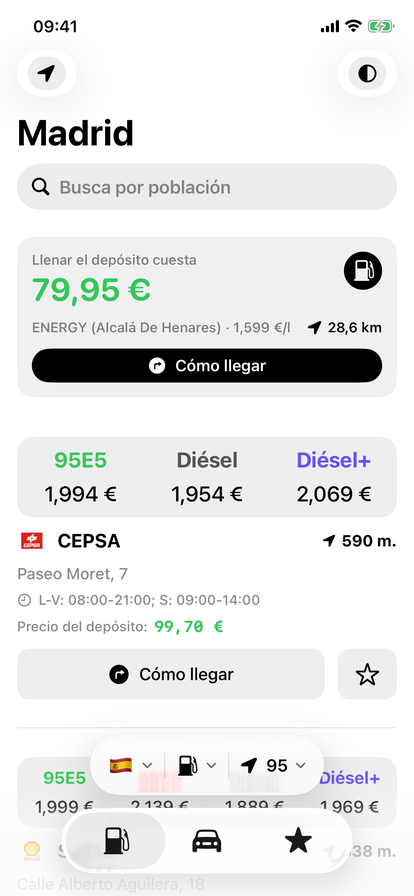
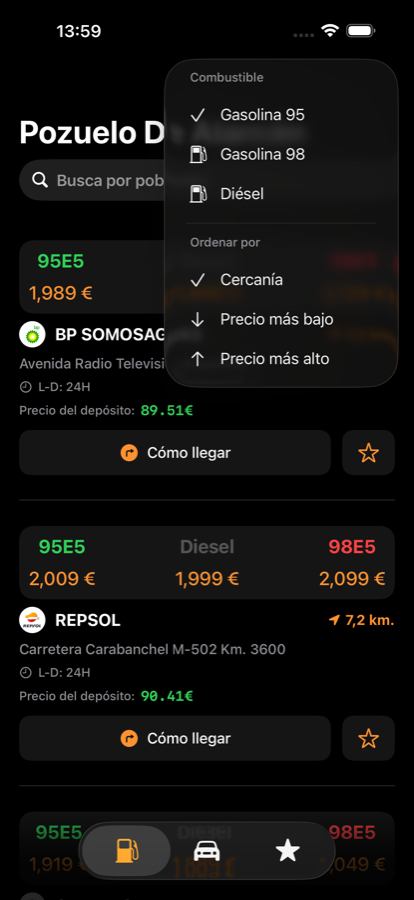
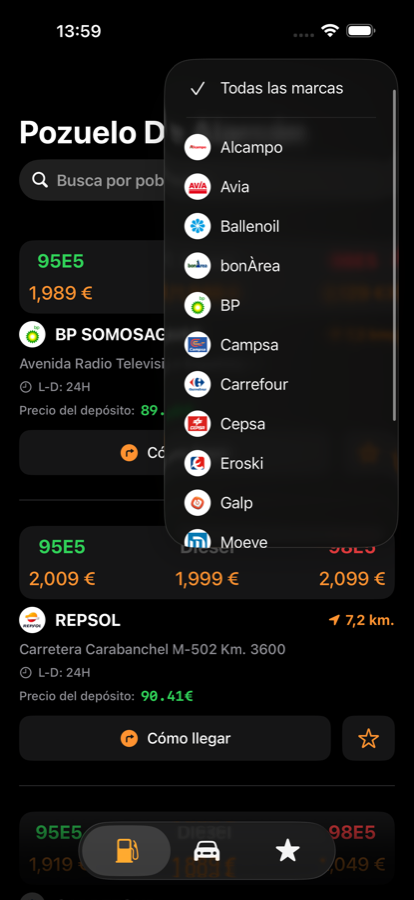
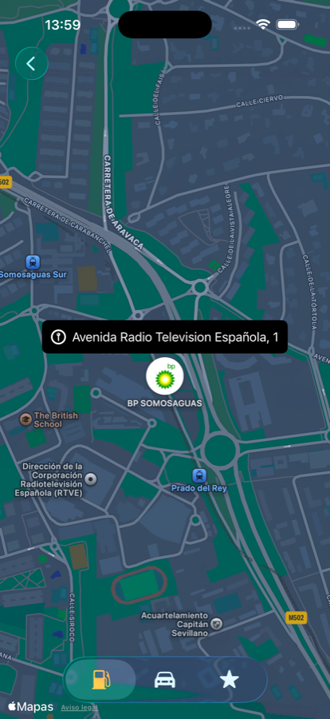
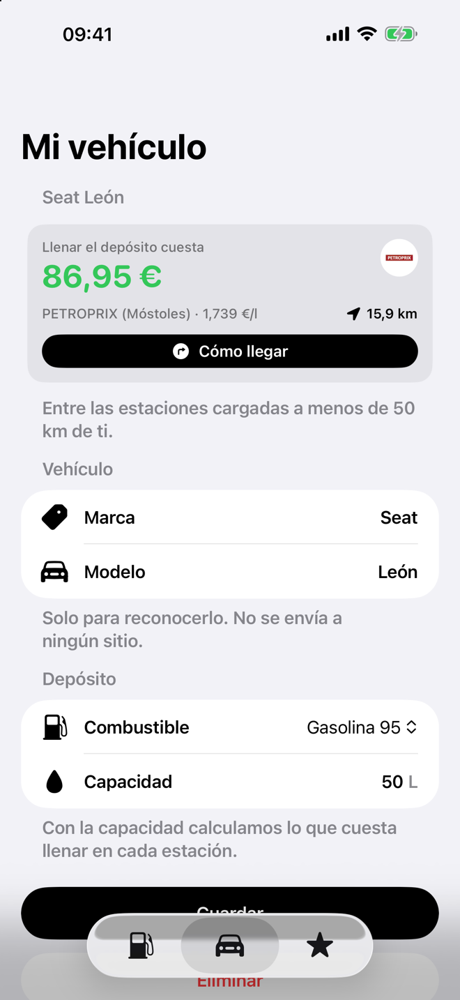

<p align="center">
  
</p>

# Gas4Oil

App para iOS y macOS que muestra el precio del carburante en las estaciones de servicio de **España, Francia, Portugal, Italia y Croacia**, con los datos oficiales de cada país. También hay [versión para Android](https://github.com/aitorsola/gas4oil-android).

Encuentra las gasolineras más cercanas, ordénalas por precio, filtra por marca o por población, guarda las que te interesen y traza la ruta en Apple Maps con un toque. Si guardas tu vehículo, la app te dice cuánto cuesta llenar el depósito y dónde sale más barato a menos de 50 km.

<p align="center">
  
  
  
</p>
<p align="center">
  
  
</p>

## Qué hace

- **Cinco países.** Con la ubicación activa la app detecta en qué país estás y carga sus estaciones; sin ella, eliges país y después población. Puedes cambiar de país desde la barra para consultar precios antes de un viaje.
- **Estaciones cercanas** con todos los combustibles que vende cada una en una sola fila, ordenadas por proximidad o por precio.
- **Filtros** por combustible (95, 95+, 98, diésel, diésel+, GLP y, en Francia, E10 y E85) y por marca, construido a partir de los datos y con logo cuando lo hay.
- **Búsqueda por población**, sin tildes y con el artículo por delante ("Las Rozas").
- **Coste del depósito**: si guardas tu vehículo, la pantalla principal y Mi vehículo muestran cuánto cuesta llenarlo en la estación más barata a menos de 50 km, con botón de ruta.
- **Favoritos**, que mantienen su precio actualizado, de cualquier país.
- **Cómo llegar**: abre la ruta en Apple Maps con el destino ya nombrado, sin salir de la celda.
- **App de macOS** con vista dividida: lista a la izquierda, detalle y mapa a la derecha.

## Datos

Cada país tiene su propio proveedor (`ServiceStationsAPI`), elegido desde `Country`. Añadir un país es un caso nuevo en ese enum y un archivo `*StationsEngine.swift`.

| País | Fuente | Formato | Notas |
|---|---|---|---|
| España | [Ministerio para la Transición Ecológica](https://sedeaplicaciones.minetur.gob.es/ServiciosRESTCarburantes/PreciosCarburantes/EstacionesTerrestres/) | JSON, ~12 MB | Unas 11.500 estaciones, varias actualizaciones al día |
| Francia | [data.economie.gouv.fr](https://data.economie.gouv.fr/explore/dataset/prix-des-carburants-en-france-flux-instantane-v2/) | JSON comprimido, ~1 MB | Sin marca; incluye servicios del área y horarios |
| Portugal | [DGEG](https://precoscombustiveis.dgeg.gov.pt) | JSON, ~4 MB | Una llamada con todos los combustibles; endpoint de su web, no documentado |
| Italia | [MIMIT](https://www.mimit.gov.it/it/open-data/elenco-dataset/carburanti-prezzi-praticati-e-anagrafica-degli-impianti) | Dos CSV, ~6 MB | Registro y precios cruzados por `idImpianto`; se usa el precio *self* |
| Croacia | [Ministarstvo gospodarstva](https://mzoe-gor.hr) | JSON, ~4 MB | El feed trae latitud y longitud intercambiadas |

Ninguna requiere clave. Los IDs de estación se desplazan por país para que no colisionen en favoritos.

> **Nota sobre TLS.** El servidor del Ministerio español aborta el handshake si el cliente ofrece TLS 1.3 y solo negocia suites sin ECDHE. La app fuerza `tlsMaximumSupportedProtocolVersion = .TLSv12` en su `URLSession` y declara una excepción de ATS para ese dominio. Sin ambas cosas la petición falla con `NSURLErrorSecureConnectionFailed`.

## Requisitos

| | |
|---|---|
| Xcode | 26 o superior |
| iOS | 18.0 |
| macOS | 15.0 |
| Swift | 5 (herramientas de Swift 6) |

## Cómo compilar

```bash
git clone https://github.com/aitorsola/gas4oil-ios.git
cd gas4oil-ios
open Gas4Oil.xcodeproj
```

Las dependencias se resuelven solas con Swift Package Manager. Desde línea de comandos:

```bash
xcodebuild -scheme "Gas4Oil (iOS)" -destination 'platform=iOS Simulator,name=iPhone 16e' build
xcodebuild -scheme "Gas4Oil (macOS)" -destination 'platform=macOS' build
```

## Arquitectura

SwiftUI con MVVM. Los view models son `@Observable` y `@MainActor`; la capa de red usa `async/await` con *typed throws*.

```
Gas4Oil/
├── Managers/
│   ├── Network/            # URLSession y un *StationsEngine por país con su mapeo a dominio
│   ├── LocationManager     # CoreLocation y geocodificación inversa (ciudad y país)
│   └── BackgroundTaskManager
├── Shared/
│   ├── Domain Models/      # Station, Country, FuelType, VehicleStored
│   ├── Scenes/             # StationsList, Map, Vehicle, FavoriteStations
│   └── Views/              # Celdas y componentes reutilizables
├── Helpers/                # Persistencia en UserDefaults
├── Extensions/
└── Resources/              # Assets, animaciones Lottie y localizaciones
```

## Idiomas

Español, inglés, catalán, gallego y euskera. Los nombres de población y dirección llegan en el idioma de cada fuente.

## Dependencias

| Paquete | Uso |
|---|---|
| [Lottie](https://github.com/airbnb/lottie-ios) | Animación de la pantalla de permisos |
| [NotificationBanner](https://github.com/Daltron/NotificationBanner) | Avisos de error de red |
| [SwiftUI-Shimmer](https://github.com/markiv/SwiftUI-Shimmer) | Esqueleto de carga de la lista |

Todas fijadas a versión en `Package.resolved`.

## Licencia

MIT. Los logos de las marcas pertenecen a sus respectivos titulares y se usan únicamente para identificar cada estación.
